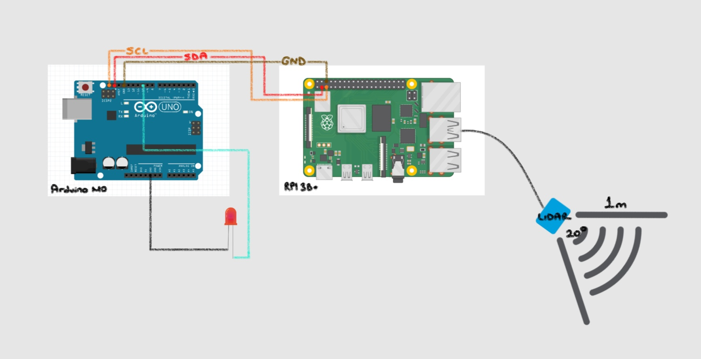
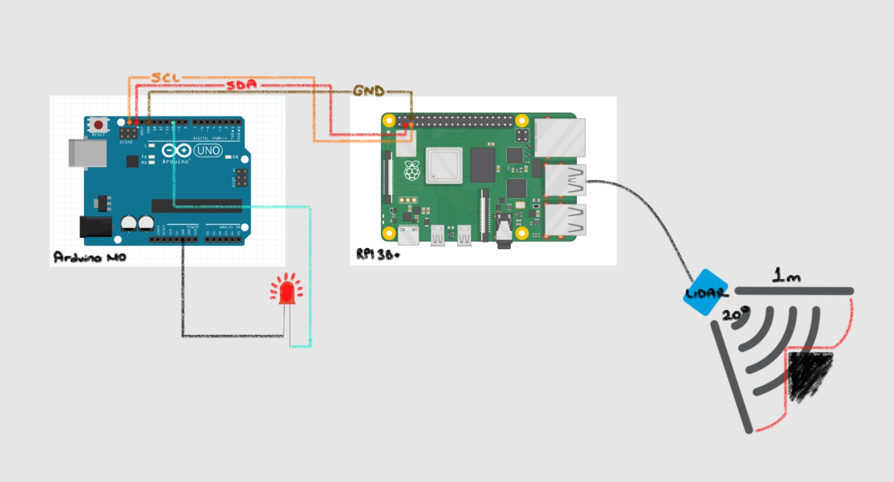

# `LIDAR`

 

 

- Lidar-based data acquisition and LED lighting application.

 

💻 Screenshots

|                             |                             |
| --------------------------- | --------------------------- |
|  |  |

 

### This project uses the following packages:

 

# License

This project is licensed under the MIT License. See the [LICENSE](LICENSE) file for details
